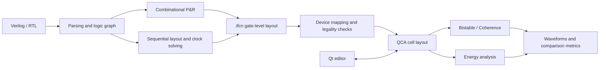

<div align="center">

# iFCN

**Design, placement, routing, and physical analysis for field-coupled nanocomputing**

Connect Verilog and `.ifcn` circuits to logic graphs, device layouts, clocks, simulation, and energy analysis.

[简体中文](README.md) · **English**

[C++17](CMakeLists.txt) · [Qt 5](src/CMakeLists.txt) · [CMake](CMakeLists.txt) · [MIT](LICENSE)

[Quick start](#quickstart) · [Algorithms](#algorithms) · [Desktop workflows](#gui) · [Command line](#cli) · [Optional modules](#optional) · [Tests](#testing)

</div>

---

iFCN is a research and development tool for Field-Coupled Nanocomputing (FCN). It provides a Qt desktop editor, several placement and routing backends, gate-to-QCA-cell mapping, and Bistable, Coherence, and energy analysis engines. The desktop application and command-line tools share core algorithms for interactive design and repeatable batch validation.

> **Repository convention:** Circuit examples retain `.ifcn` files and Verilog/SystemVerilog inputs required by the algorithms. Generate `.qca` files, waveforms, images, logs, model weights, and experiment reports under `build*/` or `output/`. Source code, tests, runtime resources, and documentation remain in version control.

<a id="overview"></a>
## Capabilities

- **Edit and inspect:** Multiple tabs, cell editing, clock phases, layers, logic schematics, clock-region encoding, and layered 3D views.
- **Place and route:** Heuristic, compact graph, fixed 2DDWave, random-clock, and optional GCN/PPO and memory-policy backends.
- **Map devices:** Convert `.ifcn` nodes and routes into QCA cells, including ports, crossovers, and IO contraction.
- **Analyze physics:** Baseline and accelerated Bistable/Coherence simulation, selective input vectors, waveform comparisons, and energy reports.
- **Explore sequential designs:** Register cuts, cyclic feedback layouts, global phase/epoch constraints, and optional Yosys/Z3 workflows.
- **Repeat experiments:** Native command-line tools, JSON/CSV metrics, CTest regressions, and an optional automation adapter.



Full RTL requires the appropriate synthesis/sequential frontend. The combinational layout engines consume supported logic netlists; arbitrary HDL is not directly routable input.

<a id="quickstart"></a>
## Quick start

### 1. Install the base dependencies

The commands below target Ubuntu/Debian-based systems. Build requirements are a C++17 compiler, CMake ≥ 3.14, Qt 5 Widgets/PrintSupport/Svg, Boost, Graphviz development libraries, and Python 3. Python 3.11 or newer is recommended for automation.

```bash
sudo apt update
sudo apt install -y build-essential cmake git pkg-config \
  qtbase5-dev libqt5svg5-dev \
  libboost-all-dev graphviz libgraphviz-dev \
  python3 python3-dev python3-venv
```

The base C++ GUI, native layout engines, and physical simulators do not require PyTorch, CUDA, Yosys, or OGDF. Python layout, training, and extended tests have [optional dependencies](#optional).

### 2. Build and launch

```bash
git clone https://github.com/li-yangshuai/iFCN.git
cd iFCN

cmake -S . -B build -DCMAKE_BUILD_TYPE=Release
cmake --build build -j2

./build/fcnx_gui
```

Large translation units can consume substantial memory during parallel compilation; adjust `-j2` to suit your machine. The project defaults to Debug when no build type is specified. Use Release for timing measurements.

### 3. Open an example

```bash
./build/fcnx_gui tests/cell_level_examples/GoodiFCN/xor2_gate_level_pr.ifcn
```

You can also open this file through the desktop interface, or select `tests/benchmarks_f/TOY/xnor2.v` for combinational placement and routing. Start with a small circuit and complete layout, mapping, and simulation before increasing the circuit size.

### Build options

| CMake option | Default | Purpose |
| --- | --- | --- |
| `IFCN_BUILD_TESTS` | `ON` | Build and register regression tests |
| `IFCN_BUILD_GCN_RL_BINDINGS` | `OFF` | Build the Python-facing `iFCN_Lab` extension |
| `IFCN_BUILD_OGDF_ORDERER` | `OFF` | Build the optional OGDF layer-ordering tool |
| `IFCN_BUILD_LEGACY_SIMON_TESTS` | `OFF` | Build the original long-running simon test executable |

<a id="algorithms"></a>
## Algorithms and scope

| Algorithm / module | Main approach | Entry point and dependencies |
| --- | --- | --- |
| Heuristic P&R / Legacy | Genetic search and A* over a selected clocking chessboard | GUI; base C++ build |
| Compact Graph P&R | Compact placement, phase-aware routing, congestion expansion, and legality-checked contraction | GUI; `ifcn_combinational_pnr compact`; base C++ build |
| 2DDWave Fixed-Clock | Graphviz/sifting ordering, a fixed four-phase template, right/down routing, and contraction with rerouting | GUI/Python backend; Python extension and backend dependencies |
| Random-clock P&R | Graph placement, four-direction routing, and phase assignment; retains the June implementation | `ifcn_combinational_pnr june_random`; base C++ build |
| GCN/PPO and universal memory policy | Graph policy, PPO, topology retrieval, and working memory; exact routing and phase checks gate candidate export | Optional Python/ML backend; inference requires a supplied or trained checkpoint |
| Register-cut layout | Explicit D/Q boundaries, routing on a cut DAG, and global phase solving | `ifcn_sequential_pnr`; base C++ build |
| Cyclic feedback layout | Feedback routes with iteration-distance, initiation-interval II, phase, and absolute-epoch checks | `ifcn_paper_cyclic_pnr`; optional external Z3 phase solver |
| Baseline / accelerated Bistable | The same Bistable update model; accelerated execution uses an order-preserving spatial interaction graph and sparse data layout | GUI; `ifcn_physical_benchmark` |
| Baseline / accelerated Coherence | The same coherence-vector model and time grid; Euler/RK4, bounded clock/input caches, and kernel fusion | GUI; `ifcn_physical_benchmark` |
| Energy analysis | Energy computation from the physical layout and clock parameters, with reports and optional waveforms | GUI; `ifcn_energy_analysis` |

**Layout legality, logic correctness, and physical waveform correctness are separate checks.** A fully routed layout does not automatically prove that the device implements the intended logic. Baseline/accelerated waveform equivalence compares two engines on the same input; it does not replace functional verification from source RTL to device behavior.

The Compact Graph dialog offers three-phase and four-phase layouts. The QCA physical models use four clock zones, so the physical suitability of a three-phase layout requires separate validation. Random search depends on its budget and seed; failures and timeouts remain failed results.

<a id="gui"></a>
## Desktop workflows

### Edit and generate a layout

1. Open an `.ifcn` file through **File → Open**, or import an external `.qca` file.
2. Edit with the cell toolbox, select/insert/drag modes, clock selector, and layer controls.
3. Use **Compact Graph Draw**, the default P&R action, or select **Heuristic P&R** or **2DDWave Fixed-Clock P&R** from its dropdown. Load a small Verilog netlist; compact layout exposes phase count and search attempts.
4. Follow routing progress and layout metrics, then inspect the logic schematic and cell layout.
5. Try reversible IO contraction with **IO Contract / Contract Cell-level IO**, and inspect the structure with clock encoding and the 3D view.

GCN/PPO and memory-policy training/inference are maintained as optional command-line workflows; they are not entries in the current P&R toolbar.

### Simulate and analyze energy

Select Bistable, Accelerated Bistable, Coherence, or Accelerated Coherence from the **Simulation** menu. Selective actions accept input vector tables; **Energy Analysis** runs the energy model.

Physical simulation actions create a temporary QCA snapshot of the current canvas, so mapped `.ifcn` layouts and unsaved cell edits can be simulated directly. The snapshot is removed after completion; result paths follow the current document. For batch work, use the CLI with an explicit output directory.

### Export

**Save cell-level layout** exports SVG or cropped PDF. The interface also supports screenshots, schematics, and layered-structure exports. Exporting `.tex` produces TikZ source; compiling that source into PDF requires a separate TeX installation.

<a id="cli"></a>
## Command-line examples

Run these commands from the repository root. All example outputs go under `build/artifacts/demo/`.

### Map `.ifcn` and compare physical engines

```bash
mkdir -p build/artifacts/demo

./build/ifcn_mapping_metrics \
  tests/cell_level_examples/GoodiFCN/xor2_gate_level_pr.ifcn --timing

./build/ifcn_energy_analysis \
  tests/cell_level_examples/GoodiFCN/xor2_gate_level_pr.ifcn \
  build/artifacts/demo/xor2 --qca-only

./build/ifcn_physical_benchmark \
  build/artifacts/demo/xor2_energy_input.qca \
  --model bistable --samples 512 --repetitions 3 --warmup 1 \
  --require-equivalent --equivalence-tolerance 0 \
  --output-prefix build/artifacts/demo/xor2 \
  --json build/artifacts/demo/bistable.json \
  --csv build/artifacts/demo/bistable.csv
```

`--qca-only` performs device mapping and QCA export. `--require-equivalent` returns a nonzero exit code if the engines disagree. `ifcn_mapping_metrics` enables IO contraction by default, while the energy tool requires `--io-contraction`; use matching settings when comparing area or cell counts.

Check Coherence and internal trajectories with:

```bash
./build/ifcn_physical_benchmark \
  build/artifacts/demo/xor2_energy_input.qca \
  --model coherence --numeric-method euler \
  --time-step 1e-16 --duration 2e-13 --repetitions 1 \
  --require-equivalent --verify-internal-state \
  --json build/artifacts/demo/coherence.json
```

A short window checks execution. Functional and performance experiments need a sufficiently long window for propagation, input periods, and settling. `--verify-internal-state` compares complete internal-state trajectories outside the timing runs; memory and runtime grow with circuit size and step count. Ablations support `--graph-mode spatial|all-pairs|reuse`, `--cache-budget-bytes`, `--disable-clock-cache`, `--disable-input-cache`, and `--disable-fusion`.

### Analyze energy

```bash
./build/ifcn_energy_analysis \
  tests/cell_level_examples/GoodiFCN/xor2_gate_level_pr.ifcn \
  build/artifacts/demo/xor2 --fast --waveform
```

`--fast` is a preview setting. For formal comparisons, explicitly match `--time-step`, `--duration`, `--clock-period`, `--input-period`, and input vectors. Fine time steps can make energy analysis expensive.

### Generate native combinational candidates

```bash
./build/ifcn_combinational_pnr compact \
  tests/benchmarks_f/TOY/xnor2.v build/artifacts/demo/compact_candidate.json

./build/ifcn_combinational_pnr june_random \
  tests/benchmarks_f/TOY/xnor2.v build/artifacts/demo/random_candidate.json
```

This interface emits candidate JSON; the Python validation adapter handles subsequent `.ifcn` export. For a resumable `parse → pnr → map → simulate → energy` pipeline, use [`scripts/ifcn_agent.py`](scripts/ifcn_agent.py), setting `IFCN_BUILD_DIR` and `IFCN_PYTHON` to the built executables and configured backend interpreter. See [`integrations/pi`](integrations/pi/README.md) for the adapter interface and optional Pi integration.

### Generate sequential and feedback layouts

```bash
./build/ifcn_sequential_pnr \
  tests/benchmarks_f/SEQUENTIAL/rtl_v/toggle_ff_cut.v \
  build/artifacts/demo/toggle_cut.ifcn \
  --state d:q --ii 4,8,12,16 --spacing 5

./build/ifcn_paper_cyclic_pnr \
  tests/benchmarks_f/SEQUENTIAL/rtl_v/toggle_ff_cut.v \
  build/artifacts/demo/toggle_cyclic.ifcn \
  --state d:q --ii 4,8 --spacing 2 \
  --route-search-cost 80 --compaction-max-states 256 --compaction-seeds 16
```

`--state d:q` defines the D-event/Q-event state boundary. II is the initiation interval in epochs. The first command checks a cut DAG; the second includes cyclic feedback constraints. Actual sequential behavior, reset, and hold behavior still require physical state structures and input-waveform validation. See the [sequential design notes](docs/sequential-design.md).

### Export without a display

```bash
QT_QPA_PLATFORM=offscreen \
  IFCN_AUTO_MAP_FILE="$PWD/tests/cell_level_examples/GoodiFCN/xor2_gate_level_pr.ifcn" \
  IFCN_AUTO_EXPORT_CELL_LAYOUT="$PWD/build/artifacts/demo/xor2.svg" \
  ./build/fcnx_gui
```

Related variables are `IFCN_AUTO_EXPORT_3D_LAYOUT`, `IFCN_AUTO_EXPORT_CIRCUIT_SCHEMATIC`, and `IFCN_AUTO_GRAPH_RENDER_FILE`. A command-line `.ifcn`/`.qca` path can replace `IFCN_AUTO_MAP_FILE` during export. Automatic export exits when it completes.

<a id="optional"></a>
## Optional modules

### Python layout, GCN/PPO, and memory policies

The optional backend uses Python development files, pybind11, PyTorch, PyTorch Geometric, scikit-learn, Matplotlib, and NetworkX. This example selects CPU PyTorch. GPU users can set `TORCH_INDEX_URL` to a wheel source compatible with their machine.

```bash
TORCH_INDEX_URL=https://download.pytorch.org/whl/cpu \
  bash include/gcn_rl_layout/scripts/setup_python_env.sh

include/gcn_rl_layout/myenv/bin/python -m pip install pybind11

cmake -S . -B build-rl -DCMAKE_BUILD_TYPE=Release \
  -DIFCN_BUILD_GCN_RL_BINDINGS=ON \
  -DPython3_EXECUTABLE="$PWD/include/gcn_rl_layout/myenv/bin/python" \
  -Dpybind11_DIR="$(include/gcn_rl_layout/myenv/bin/python -m pybind11 --cmakedir)"
cmake --build build-rl -j2

export IFCN_GCN_RL_PYTHON="$PWD/include/gcn_rl_layout/myenv/bin/python"
./build-rl/fcnx_gui
```

The extension is generated only under the build directory's `python/lib/`, here `build-rl/python/lib/iFCN_Lab*.so`. The backend automatically discovers the repository's `build-rl/`, `build/`, and `include/gcn_rl_layout/build/`. For another build directory, set `IFCN_GCN_RL_BINDINGS_DIR=/path/to/build/python/lib`; this overrides automatic discovery. A clean checkout contains no virtual environment, binary extension, or trained weights.

Minimal training example:

```bash
include/gcn_rl_layout/myenv/bin/python \
  include/gcn_rl_layout/src/algorithm/main/train_universal_graph_ppo.py \
  --benchmarks tests/benchmarks_f/TOY/xor2.v tests/benchmarks_f/TOY/xnor2.v \
  --clock-mode stochastic-bands --device cpu \
  --episodes 2000 --exact-field-samples 4 \
  --output-dir build/artifacts/universal_graph_ppo
```

Training does not guarantee success on new circuits. Evaluate with independent circuits and clock seeds, using the evaluation script's `--require-unseen` guard. Pass a valid checkpoint explicitly to the inference runner. See the [GCN/RL README](include/gcn_rl_layout/README.md) and the [stochastic-clock and universal-policy design](include/gcn_rl_layout/UNIVERSAL_STOCHASTIC_CLOCK.md).

### Yosys, Z3, OGDF, and TeX

| Optional dependency | Purpose | Configuration |
| --- | --- | --- |
| Yosys | Synthesize supported sequential RTL for the conversion frontend | Install `yosys`; pass `--yosys`, `--cut-pnr`, and `--cyclic-pnr` explicitly to `scripts/run_sequential_rtl_experiments.py` |
| Z3 Python API | Solve global phase/epoch constraints for exported fixed geometry | Install `python3-z3`, or `z3-solver` in the selected Python environment; entry point: `scripts/solve_global_clock_z3.py` |
| OGDF | Optional crossing minimization within fixed layers | Enable `-DIFCN_BUILD_OGDF_ORDERER=ON`; use `-DOGDF_SOURCE_DIR=/path/to/ogdf` for local sources, otherwise CMake downloads the configured revision |
| LaTeX/TikZ | Compile exported `.tex` figures | Install packages such as `texlive-latex-extra` and `texlive-pictures` as needed; GUI and physical simulation builds do not require TeX |

<a id="testing"></a>
## Tests and execution checks

The [latest integration and execution validation](docs/validation.md) records the environment, results, and optional-module coverage.

```bash
cmake --build build -j2
ctest --test-dir build --output-on-failure
```

Regressions cover device mapping, crossovers, IO contraction, phase-aware routing, compact layout, sequential IR/global phase solving, simulation metrics, and baseline/accelerated equivalence. Small QCA and vector-table inputs are generated in the build directory, so these intermediate circuit files do not need to be retained beside source examples.

Run a focused subset with:

```bash
ctest --test-dir build --output-on-failure -R 'mapping|contraction'
ctest --test-dir build --output-on-failure -R 'accelerated|interaction|simulation'
ctest --test-dir build --output-on-failure -R 'sequential|phase'
```

Check the Python workflows and optional integration independently:

```bash
python3 -m unittest discover -s tests -p 'test_*.py'
python3 -m unittest discover -s integrations/pi -p 'test_*.py'
```

After setting up the optional GCN/RL environment and extension, use pytest to collect the full backend suite, which contains both unittest classes and pytest functions:

```bash
include/gcn_rl_layout/myenv/bin/python -m pip install pytest
include/gcn_rl_layout/myenv/bin/python -m pytest include/gcn_rl_layout/tests
```

Z3-dependent tests are registered when the selected Python interpreter can import `z3`. Install `z3-solver` in that environment and rerun CMake to include them; `IFCN_Z3_ROOT` can point to an external extracted installation. Other optional backend tests depend on their libraries and CMake configuration. List registered tests with `ctest --test-dir build -N`, and report passed, skipped, and unconfigured checks separately. Long-running external simon datasets and ML training are outside the scope of a base build check.

Use `QT_QPA_PLATFORM=offscreen` when no display is available. GUI startup/export checks verify window and file handling; CLI and regression tests verify physical-engine equivalence.

<a id="structure"></a>
## Repository structure and generated files

```text
iFCN/
├── CMakeLists.txt                # Build options and core targets
├── README.md / README.en.md      # 中文 / English
├── src/
│   ├── app/                     # GUI and native CLI entry points
│   ├── controllers/             # Layout, mapping, simulation orchestration
│   └── ui/                      # Windows, canvas, graph and waveform views
├── include/
│   ├── autopr/                  # Graphs, grids, P&R, mapping, sequential algorithms
│   ├── simon/                   # Physical models, acceleration, metrics, traces
│   └── gcn_rl_layout/           # Optional Python / GCN / PPO backend
├── resources/ui_images/         # Runtime icons and Qt resources
├── tests/
│   ├── benchmarks_f/           # Algorithm Verilog inputs and .ifcn examples
│   └── cell_level_examples/    # Retained .ifcn circuits
├── examples/                    # Additional organized .ifcn layouts
├── scripts/                     # Conversion, batch runs, validation, summaries
├── integrations/pi/             # Optional automation interface
├── docs/                        # Maintained engineering documentation
└── build*/ / output/            # Local generated files; not versioned
```

| File | Role | Storage convention |
| --- | --- | --- |
| `.ifcn` | Project circuits, gate layouts, clock/route information | Keep maintained examples in version control |
| `.v` / `.sv` | HDL inputs required by algorithms and frontends | Maintain with the associated example or test |
| `.qca` | Compatible external input or mapped physical layout | Import or generate on demand into an output directory |
| `.vt` / `.rst` | Selective input vectors / simulation waveforms | Generate at runtime or keep user-provided inputs outside the repository |
| `.json` / `.csv` / `.txt` | Parameters, metrics, reports | Put experiment outputs in build directories; maintain source configuration by purpose |
| `.svg` / `.pdf` / `.png` / `.tex` | Graphics and editable exports | Use output directories; application icons are runtime resources |
| `.pt` / `.so` / virtual environments | Weights, extensions, dependencies | Install or train locally; do not commit |

Some GUI workflows write results beside the input. For strict separation, place a working copy under `build/artifacts/`, or use a CLI with explicit output paths. Run `git status --short` before committing to check for generated results, caches, and machine-specific settings.

<a id="troubleshooting"></a>
## Troubleshooting

| Symptom | Action |
| --- | --- |
| CMake cannot find `Qt5Svg` | Install `libqt5svg5-dev` and configure again |
| Missing `libgvc` / `libcgraph` | Install `graphviz libgraphviz-dev pkg-config` |
| Compiler process is killed | Reduce parallelism, for example `cmake --build build -j1` |
| Qt platform error without a display | Use `QT_QPA_PLATFORM=offscreen` for export/checks; interactive editing needs a desktop display |
| Python cannot import `iFCN_Lab` or ML packages | Install dependencies and build with the same interpreter; check `IFCN_GCN_RL_PYTHON` and set `IFCN_GCN_RL_BINDINGS_DIR` for custom build directories |
| Memory policy cannot find a checkpoint | Train or supply compatible weights and specify the checkpoint; weights are not distributed with the source |
| Sequential runner cannot find Yosys/native tools | Override `--yosys`, `--cut-pnr`, and `--cyclic-pnr`; experimental defaults may differ from local paths |
| Layout fails or phases are unsatisfiable | Start small, check netlist/ports, increase budget/spacing or adjust II; do not count partial routing as success |
| Energy/Coherence execution is slow | Check the flow with a short window, then choose the required time step and duration; distinguish preview and experiment settings |

## Development and license

Give new algorithms explicit entry points and document their scope. Run relevant regressions when modifying mapping, clock, or simulation update rules, and report inputs, parameters, and failures. Update both language versions when changing user-visible behavior.

The project is distributed under the [MIT License](LICENSE). Third-party libraries and components retain their own licenses.

<div align="center">

[Back to top](#ifcn) · [简体中文](README.md)

</div>
