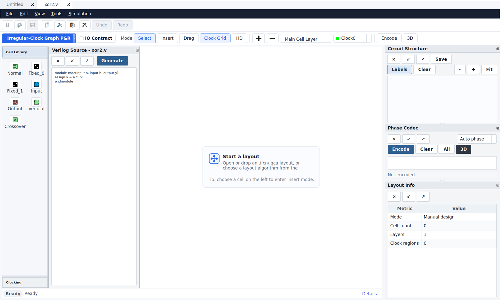
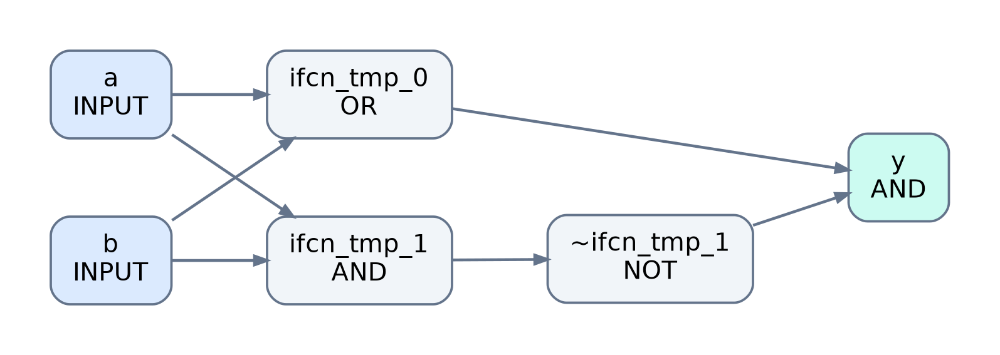
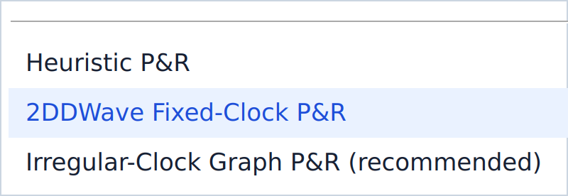
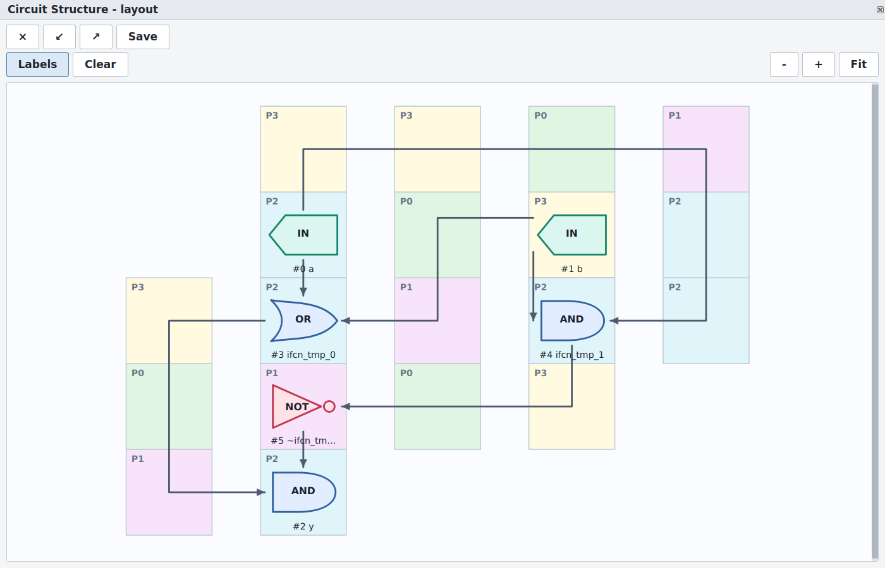
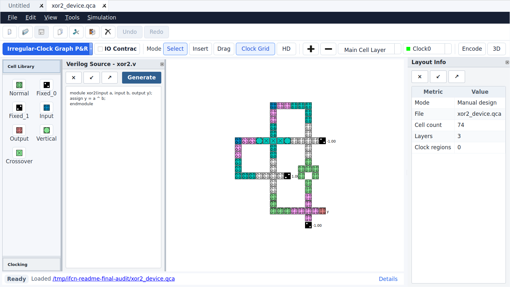
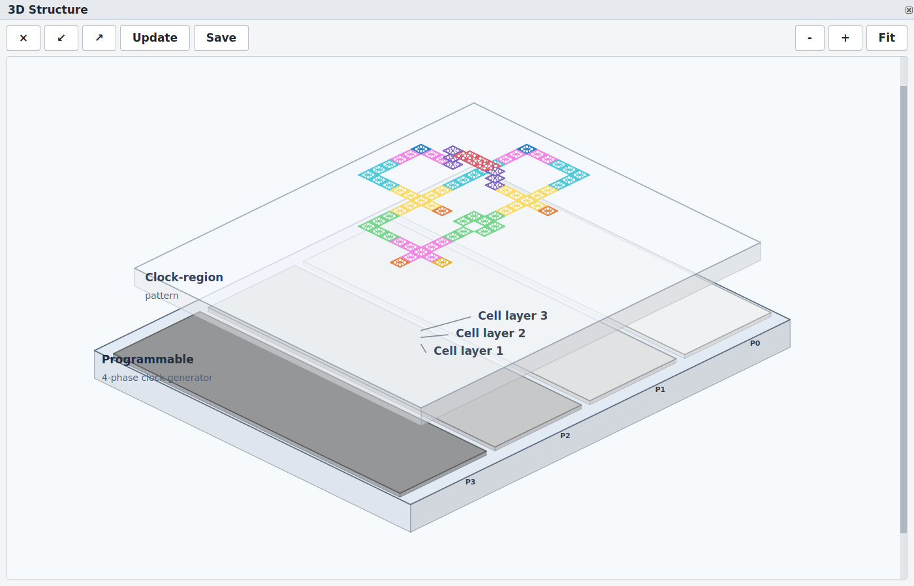
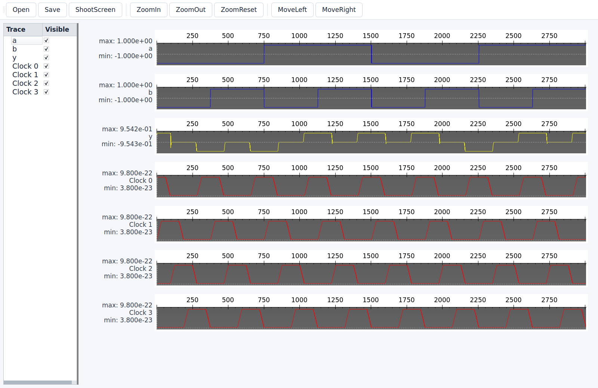
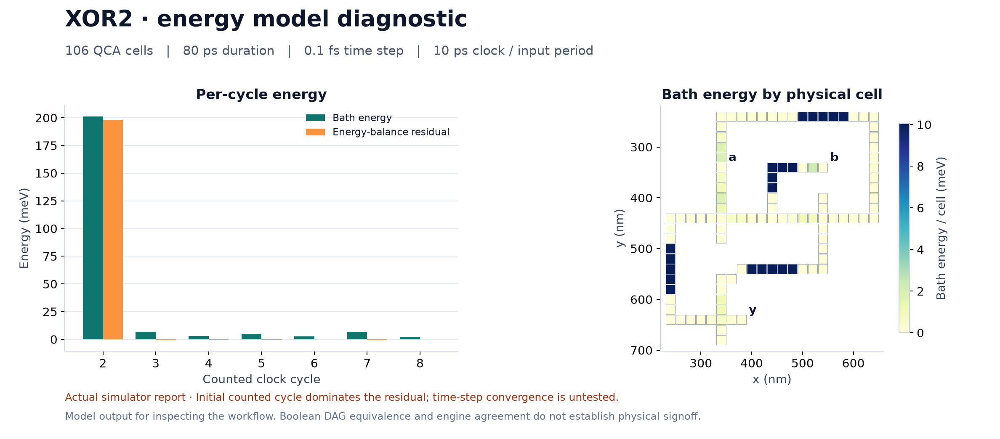
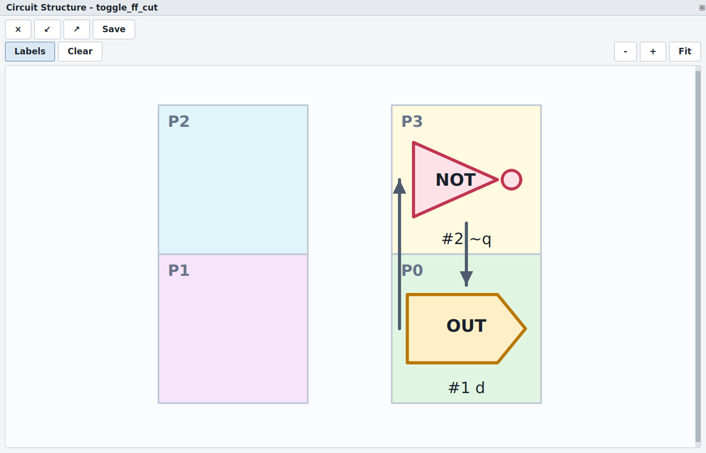
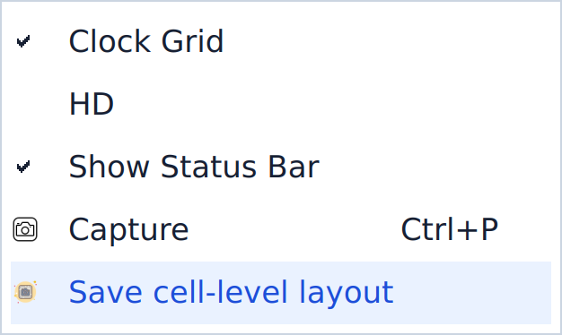

<div align="center">

# iFCN

**Design, place, route, and simulate field-coupled nanocircuits**

Edit circuits, generate layouts, inspect clocks and 3D structures, and run physical simulation and energy analysis.

[简体中文](README.md) · **English**

[Install and launch](#quickstart) · [Features and workflow](#xor-walkthrough) · [Simulation](#simulation) · [Export](#export)

</div>

---

iFCN is a Qt desktop editor that connects Verilog logic, circuit layout, QCA cell mapping, and simulation results in one workflow. It provides three combinational P&R families: regular-clock heuristics, fixed-2DDWave graph drawing, and irregular-clock graph drawing, plus a separate sequential P&R flow.

Desktop downloads: [Windows / macOS / Linux Release](https://github.com/li-yangshuai/iFCN/releases/latest). See the [release guide](docs/release-v1.0.0.md) for installation and platform coverage.

<a id="quickstart"></a>
## Install and launch

Install dependencies and build on Ubuntu / Debian:

```bash
sudo apt update
sudo apt install -y build-essential cmake git pkg-config \
  qtbase5-dev libqt5svg5-dev libboost-all-dev graphviz libgraphviz-dev \
  python3 python3-dev python3-venv

git clone https://github.com/li-yangshuai/iFCN.git
cd iFCN
cmake -S . -B build -DCMAKE_BUILD_TYPE=Release
cmake --build build -j2
./build/fcnx_gui
```

<a id="optional"></a>
<details>
<summary>Enable classical Python 2DDWave layout</summary>

Before using this backend, install NumPy, Matplotlib, NetworkX, SciPy, and pybind11, then enable the extension in the same build directory:

```bash
bash include/layout_backend/scripts/setup_python_env.sh
cmake -S . -B build -DCMAKE_BUILD_TYPE=Release \
  -DIFCN_BUILD_LAYOUT_BINDINGS=ON \
  -DPython3_EXECUTABLE="$PWD/include/layout_backend/myenv/bin/python" \
  -Dpybind11_DIR="$(include/layout_backend/myenv/bin/python -m pybind11 --cmakedir)"
cmake --build build -j2

export IFCN_LAYOUT_PYTHON="$PWD/include/layout_backend/myenv/bin/python"
export IFCN_LAYOUT_BINDINGS_DIR="$PWD/build/python/lib"
./build/fcnx_gui
```

</details>

<a id="xor-walkthrough"></a>
## Features and workflow

The screenshots show a two-input XOR routed with fixed 2DDWave clocks. The example passed combinational DRC and settled-output checks for all four slow input combinations in both Bistable and Coherence.

### 1. Open or edit a circuit

Use **File → Open** to open an `.ifcn` circuit. You can also import `.qca` files or open Verilog source to start automatic layout. Tabs let you work with multiple designs.

Edit inputs, outputs, and logic expressions in the source editor. On the cell canvas, use **Select / Insert / Drag** to select, add, and move cells. Copy, paste, undo, and redo are supported.



### 2. Parse and inspect the logic

Click **Generate** in the source editor, choose a layout method, and generate the circuit. Inspect the connections between inputs, logic nodes, and outputs; the graph below was generated from the actual parser output.



<a id="algorithms"></a>
### 3. Choose a layout method

Click **Irregular-Clock Graph P&R** on the toolbar to start layout, or use its arrow to choose another method:



| Algorithm family and UI option | How to use it |
| --- | --- |
| Regular-clock heuristics · **Heuristic P&R** | Choose USE, RES or 2DDWave, set the grid and search parameters, and run genetic search with A* routing |
| Fixed-2DDWave graph drawing · **2DDWave Fixed-Clock P&R** | Enable the Python backend above, then generate and contract a fixed four-phase layout |
| Irregular-clock graph drawing · **Irregular-Clock Graph P&R** | Load a netlist and set the phase count, attempts and time budget; search and compact candidates, selecting the smallest area that passes DRC |

Watch the progress and check results, then inspect routes and phases in the schematic. Layout engines check routing completeness, crossings, and phase constraints. If a run fails, follow the reported reason to adjust the input or search settings.

Open an `.ifcn` from [examples](examples/) to inspect a generated layout, organized by algorithm. Regular-clock examples use TOY; irregular-clock examples use TOY and MAJ. The [example validation table](docs/examples.md) records inputs and checks. A `__drc_only` suffix identifies a failed physical-output check; these circuits are not functionally validated examples.



### 4. Inspect mapped cells and clocks

After layout, inspect the mapped QCA cells on the main canvas. Use **Clock0–Clock3** to set cell phases, **Clock Grid** to show or hide the clock grid, and **Encode** to inspect clock-region encoding.

Check **IO Contract** to shorten input/output connections; clear it to restore the original layout. Layer controls let you switch, add, and remove cell layers.

IO Contract operates on device input/output connections. Layout compaction optimizes clock tiles and gate positions; these are separate features.



### 5. Inspect the 3D structure

Click **3D** to open the layered structure view and inspect interlayer connections, cell positions, and phases. The 2D canvas and 3D view represent the same circuit.



<a id="simulation"></a>
### 6. Run Bistable simulation

Choose **Simulation → Start Bistable Simulation**, set the parameters, and run. For the accelerated version, select **Start Accelerated Bistable Simulation**. Inspect input and output polarization traces in the waveform window after the run.

Use **Start Bistable With Selective Simulation** to supply an input vector table. Simulation uses the circuit on the current canvas, including unsaved cell edits.

Read the output during its clock's hold phase: polarization near +1 / −1 represents 1 / 0. Values near zero during release are not stable logic values.


### 7. Run Coherence simulation

Choose **Simulation → Start Coherence Simulation** and set the time step and duration. **Start Accelerated Coherence Simulation** and Selective input mode are also available.

The waveform window displays stored samples so you can compare the input and output response.



### 8. Read energy results

Choose **Simulation → Energy Analysis** and set clock and run parameters. Inspect per-cycle energy and residuals after the run. If residuals are large, adjust the time step and simulation window and check again.



### 9. Inspect sequential circuits

Use **File → Open** to load the [feedback example](examples/sequential/cyclic/toggle_ff.ifcn) and inspect its feedback path and clock regions. The [register-cut example](examples/sequential/register_cut/toggle_ff.ifcn) preserves separate D/Q boundaries. To generate a design from RTL, use the [sequential layout commands](docs/algorithm-availability.md).

Sequential routing preserves cross-cycle distances and solves global clocks and the initiation interval. These examples pass structural, mapping, and clock checks; complete multi-cycle physical state behavior still requires validation.



<a id="export"></a>
## Save and export

- **File → Save / Save As**: save an editable circuit.
- **View → Save cell-level layout**: export SVG or cropped PDF for reports and papers.
- **View** screenshot action: capture the application view; logic graphs and layered structures also provide exports.



The GUI and batch tools share one irregular-clock layout algorithm, including candidate search, clock assignment and compaction. Sequential circuits use separate register-cut, cyclic-feedback and global clock-solving flows.

Further reading: [Algorithm results](docs/algorithm-availability.md) · [Classical layout backend](include/layout_backend/README.md) · [Sequential design](docs/sequential-design.md) · [Validation record](docs/validation.md)

<div align="center">

[Back to top](#ifcn) · [简体中文](README.md) · [Licenses](NOTICE)

</div>
