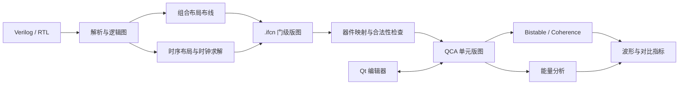

<div align="center">

# iFCN

**场耦合纳米计算电路的设计、布局布线与物理分析**

从 Verilog 与 `.ifcn` 出发，连接逻辑图、器件版图、时钟、仿真和能量分析。

**简体中文** · [English](README.en.md)

[C++17](CMakeLists.txt) · [Qt 5](src/CMakeLists.txt) · [CMake](CMakeLists.txt) · [MIT](LICENSE)

[快速开始](#quickstart) · [算法](#algorithms) · [图形界面](#gui) · [命令行](#cli) · [可选模块](#optional) · [测试](#testing)

</div>

---

iFCN 是面向场耦合纳米计算（Field-Coupled Nanocomputing，FCN）的研究与开发工具。项目提供 Qt 桌面编辑器、多个自动布局布线后端、门级到 QCA 单元级映射，以及 Bistable、Coherence 和能量分析引擎。桌面工具和命令行工具共用核心算法，便于交互设计与可重复的批量验证。

> **仓库约定：** 电路样例保留 `.ifcn` 与算法必需的 Verilog/SystemVerilog 输入；`.qca`、波形、图片、日志、模型权重和实验报告按需生成，写入 `build*/` 或 `output/`。源码、测试、运行资源与文档正常保留。

<a id="overview"></a>
## 能做什么

- **编辑与观察：** 多标签页、单元编辑、时钟相位和层管理、逻辑原理图、时钟区域编码与分层 3D 视图。
- **自动布局布线：** 启发式、紧凑图布局、固定 2DDWave、随机时钟，以及可选 GCN/PPO 和记忆策略。
- **器件映射：** `.ifcn` 门级节点和路径映射为 QCA 单元，处理端口、交叉结构和 IO 收缩。
- **物理分析：** 基线及加速 Bistable/Coherence 仿真、选择性输入向量、波形比较与能量报告。
- **时序设计：** 寄存器切分、带反馈的周期布局、全局相位/epoch 约束，以及可选 Yosys/Z3 流程。
- **可重复运行：** 独立命令行程序、JSON/CSV 指标、CTest 回归和可选自动化适配器。



完整 RTL 需要专门的综合/时序前端；组合布局器的输入是受支持的逻辑网表，不能把任意 HDL 直接当作可布线电路。

<a id="quickstart"></a>
## 快速开始

### 1. 安装基础依赖

下面给出 Ubuntu/Debian 系发行版的源码构建方式。需要 C++17 编译器、CMake ≥ 3.14、Qt 5 Widgets/PrintSupport/Svg、Boost、Graphviz 开发库和 Python 3。Python 自动化建议使用 3.11 或更新版本。

```bash
sudo apt update
sudo apt install -y build-essential cmake git pkg-config \
  qtbase5-dev libqt5svg5-dev \
  libboost-all-dev graphviz libgraphviz-dev \
  python3 python3-dev python3-venv
```

基础 C++ GUI、原生布局器和物理仿真无需 PyTorch、CUDA、Yosys 或 OGDF。部分 Python 布局、训练及扩展测试需要[可选依赖](#optional)。

### 2. 构建并启动

```bash
git clone https://github.com/li-yangshuai/iFCN.git
cd iFCN

cmake -S . -B build -DCMAKE_BUILD_TYPE=Release
cmake --build build -j2

./build/fcnx_gui
```

大源文件在并行编译时占用较多内存；根据机器情况调整 `-j2`。未指定构建类型时工程默认使用 Debug；测量运行时间时使用 Release。

### 3. 打开一个样例

```bash
./build/fcnx_gui tests/cell_level_examples/GoodiFCN/xor2_gate_level_pr.ifcn
```

也可在界面中打开上述文件，或选择 `tests/benchmarks_f/TOY/xnor2.v` 开始组合电路布局。第一次使用建议先完成小电路的布局、映射和仿真，再增加电路规模。

### 构建选项

| CMake 选项 | 默认值 | 作用 |
| --- | --- | --- |
| `IFCN_BUILD_TESTS` | `ON` | 构建并注册回归测试 |
| `IFCN_BUILD_GCN_RL_BINDINGS` | `OFF` | 构建 Python 调用的 `iFCN_Lab` 扩展 |
| `IFCN_BUILD_OGDF_ORDERER` | `OFF` | 构建可选 OGDF 层内排序程序 |
| `IFCN_BUILD_LEGACY_SIMON_TESTS` | `OFF` | 构建原始长耗时 simon 测试程序 |

<a id="algorithms"></a>
## 算法与运行边界

| 算法 / 模块 | 核心方法 | 入口与依赖 |
| --- | --- | --- |
| 启发式 P&R（Legacy） | 遗传搜索与 A*，在指定时钟棋盘上寻找布局与路径 | GUI；基础 C++ 构建 |
| Compact Graph P&R | 紧凑放置、相位感知布线、拥塞扩张和经过合法性检查的收缩 | GUI；`ifcn_combinational_pnr compact`；基础 C++ 构建 |
| 2DDWave Fixed-Clock | Graphviz/sifting 排序、固定四相位模板、右下方向布线与重布线收缩 | GUI/Python 后端；需要 Python 扩展与后端依赖 |
| 随机时钟 P&R | 图布局、四方向布线与相位分配；保留 June 随机时钟实现 | `ifcn_combinational_pnr june_random`；基础 C++ 构建 |
| GCN/PPO 与通用记忆策略 | 图策略、PPO、拓扑检索与工作记忆，候选经精确布线及相位检查后导出 | 可选 Python/ML 后端；推理需用户提供或训练 checkpoint |
| 寄存器切分布局 | 将 D/Q 边界显式化，在切分 DAG 上布线并求全局相位 | `ifcn_sequential_pnr`；基础 C++ 构建 |
| 周期反馈布局 | 恢复反馈路径，检查迭代距离、启动间隔 II、相位及绝对 epoch | `ifcn_paper_cyclic_pnr`；Z3 可作为外部相位求解器 |
| Bistable 基线 / 加速 | 同一 Bistable 更新模型；加速版本使用保持顺序的空间相互作用图和稀疏数据布局 | GUI；`ifcn_physical_benchmark` |
| Coherence 基线 / 加速 | 同一相干矢量模型与时间网格；支持 Euler/RK4、受预算约束的时钟/输入缓存和内核融合 | GUI；`ifcn_physical_benchmark` |
| 能量分析 | 基于物理版图与时钟参数计算能量，输出报告与可选波形 | GUI；`ifcn_energy_analysis` |

**布局合法性、逻辑正确性、物理波形正确性是不同的检查。** 找到完整路径并不自动证明物理电路实现了预期逻辑。基线/加速波形一致性只比较两种引擎对同一输入的数值结果，不替代源 RTL 到器件行为的功能验证。

Compact Graph 界面提供三相位/四相位布局选项；QCA 物理模型使用四个时钟区，三相位布局的物理可用性需要单独检查。随机搜索受预算与种子影响，失败或超时应保留为失败结果。

<a id="gui"></a>
## 图形界面工作流

### 编辑与自动布局

1. 使用 **File → Open** 打开 `.ifcn`；也可导入外部 `.qca`。
2. 通过单元工具箱、选择/插入/拖动模式、相位选择器与层控件编辑版图。
3. 使用默认的 **Compact Graph Draw**，或从下拉菜单选择 **Heuristic P&R**、**2DDWave Fixed-Clock P&R**，载入小型 Verilog 网表；紧凑布局可调整相位数和搜索次数。
4. 查看进度区域的布线状态与布局指标，成功后检查逻辑原理图和单元级版图。
5. 使用 **IO Contract / Contract Cell-level IO** 尝试可恢复的 IO 收缩；通过时钟编码与 3D 视图检查层次结构。

GCN/PPO 和记忆策略训练、推理作为可选命令行流程维护，当前布局布线工具栏不显示这些入口。

### 仿真与能量

在 **Simulation** 菜单选择 Bistable、Accelerated Bistable、Coherence 或 Accelerated Coherence。Selective 项用于指定输入向量表，**Energy Analysis** 用于能量分析。

物理仿真动作会从当前画布生成临时 QCA 快照，因此映射后的 `.ifcn` 和未保存的单元修改也可直接参与仿真。快照在完成后清理，结果文件按当前文档位置输出。批量工作建议使用命令行并显式指定输出目录。

### 导出

**Save cell-level layout** 支持 SVG 或裁切 PDF；界面也提供截图、逻辑图与分层结构导出。生成 `.tex` 只是输出 TikZ 源码；编译 PDF 还需自行安装 TeX 环境。

<a id="cli"></a>
## 命令行示例

以下命令均在仓库根目录执行，输出统一置于 `build/artifacts/demo/`。

### 映射 `.ifcn` 并比较物理引擎

```bash
mkdir -p build/artifacts/demo

./build/ifcn_mapping_metrics \
  tests/cell_level_examples/GoodiFCN/xor2_gate_level_pr.ifcn --timing

./build/ifcn_energy_analysis \
  tests/cell_level_examples/GoodiFCN/xor2_gate_level_pr.ifcn \
  build/artifacts/demo/xor2 --qca-only

./build/ifcn_physical_benchmark \
  build/artifacts/demo/xor2_energy_input.qca \
  --model bistable --samples 512 --repetitions 3 --warmup 1 \
  --require-equivalent --equivalence-tolerance 0 \
  --output-prefix build/artifacts/demo/xor2 \
  --json build/artifacts/demo/bistable.json \
  --csv build/artifacts/demo/bistable.csv
```

`--qca-only` 只做器件映射与 QCA 导出；`--require-equivalent` 在两种引擎不等价时返回非零退出码。`ifcn_mapping_metrics` 默认启用 IO 收缩，能量工具需显式添加 `--io-contraction` 才启用；比较面积或单元数时应统一设置。

验证 Coherence 和内部轨迹，可继续运行：

```bash
./build/ifcn_physical_benchmark \
  build/artifacts/demo/xor2_energy_input.qca \
  --model coherence --numeric-method euler \
  --time-step 1e-16 --duration 2e-13 --repetitions 1 \
  --require-equivalent --verify-internal-state \
  --json build/artifacts/demo/coherence.json
```

短时间窗口适合运行检查；功能与性能实验应根据传播延迟、输入周期和稳态条件设置足够长的窗口。`--verify-internal-state` 在计时外比较完整内部状态轨迹；内存和运行开销随电路与步数增长。消融实验支持 `--graph-mode spatial|all-pairs|reuse`、`--cache-budget-bytes`、`--disable-clock-cache`、`--disable-input-cache` 和 `--disable-fusion`。

### 能量分析

```bash
./build/ifcn_energy_analysis \
  tests/cell_level_examples/GoodiFCN/xor2_gate_level_pr.ifcn \
  build/artifacts/demo/xor2 --fast --waveform
```

`--fast` 用于快速预览。正式比较应显式统一 `--time-step`、`--duration`、`--clock-period`、`--input-period` 和输入向量；细时间步分析可能耗时较长。

### 原生组合布局候选

```bash
./build/ifcn_combinational_pnr compact \
  tests/benchmarks_f/TOY/xnor2.v build/artifacts/demo/compact_candidate.json

./build/ifcn_combinational_pnr june_random \
  tests/benchmarks_f/TOY/xnor2.v build/artifacts/demo/random_candidate.json
```

此接口输出候选 JSON；后续 `.ifcn` 导出由 Python 验证适配器完成。需要 `parse → pnr → map → simulate → energy` 的可恢复流程，可使用 [`scripts/ifcn_agent.py`](scripts/ifcn_agent.py)，设置 `IFCN_BUILD_DIR` 与 `IFCN_PYTHON` 指向已构建程序和已安装后端的 Python。接口及 Pi 集成见 [`integrations/pi`](integrations/pi/README.md)。

### 时序与反馈布局

```bash
./build/ifcn_sequential_pnr \
  tests/benchmarks_f/SEQUENTIAL/rtl_v/toggle_ff_cut.v \
  build/artifacts/demo/toggle_cut.ifcn \
  --state d:q --ii 4,8,12,16 --spacing 5

./build/ifcn_paper_cyclic_pnr \
  tests/benchmarks_f/SEQUENTIAL/rtl_v/toggle_ff_cut.v \
  build/artifacts/demo/toggle_cyclic.ifcn \
  --state d:q --ii 4,8 --spacing 2 \
  --route-search-cost 80 --compaction-max-states 256 --compaction-seeds 16
```

`--state d:q` 指定 D 事件与 Q 事件的状态边界；II 是以 epoch 计的启动间隔。第一条命令验证切分后的 DAG，第二条包含周期反馈约束。真实顺序逻辑、复位和保持行为仍需结合物理状态结构与输入波形验证。流程细节见[时序设计说明](docs/sequential-design.md)。

### 无显示器导出

```bash
QT_QPA_PLATFORM=offscreen \
  IFCN_AUTO_MAP_FILE="$PWD/tests/cell_level_examples/GoodiFCN/xor2_gate_level_pr.ifcn" \
  IFCN_AUTO_EXPORT_CELL_LAYOUT="$PWD/build/artifacts/demo/xor2.svg" \
  ./build/fcnx_gui
```

相关环境变量包括 `IFCN_AUTO_EXPORT_3D_LAYOUT`、`IFCN_AUTO_EXPORT_CIRCUIT_SCHEMATIC` 和 `IFCN_AUTO_GRAPH_RENDER_FILE`。导出时，也可用命令行 `.ifcn`/`.qca` 路径代替 `IFCN_AUTO_MAP_FILE`。自动导出结束后程序退出。

<a id="optional"></a>
## 可选模块

### Python 布局、GCN/PPO 与记忆策略

可选后端需要 Python 开发环境、pybind11、PyTorch、PyTorch Geometric、scikit-learn、Matplotlib 和 NetworkX。以下示例选择 CPU 版 PyTorch；GPU 用户可通过 `TORCH_INDEX_URL` 选择与机器兼容的安装源。

```bash
TORCH_INDEX_URL=https://download.pytorch.org/whl/cpu \
  bash include/gcn_rl_layout/scripts/setup_python_env.sh

include/gcn_rl_layout/myenv/bin/python -m pip install pybind11

cmake -S . -B build-rl -DCMAKE_BUILD_TYPE=Release \
  -DIFCN_BUILD_GCN_RL_BINDINGS=ON \
  -DPython3_EXECUTABLE="$PWD/include/gcn_rl_layout/myenv/bin/python" \
  -Dpybind11_DIR="$(include/gcn_rl_layout/myenv/bin/python -m pybind11 --cmakedir)"
cmake --build build-rl -j2

export IFCN_GCN_RL_PYTHON="$PWD/include/gcn_rl_layout/myenv/bin/python"
./build-rl/fcnx_gui
```

扩展仅生成到构建目录的 `python/lib/`，上例为 `build-rl/python/lib/iFCN_Lab*.so`。后端自动发现仓库中的 `build-rl/`、`build/` 和 `include/gcn_rl_layout/build/`；使用其他构建目录时，设置 `IFCN_GCN_RL_BINDINGS_DIR=/path/to/build/python/lib`，该设置优先于自动发现。干净仓库不携带虚拟环境、二进制扩展或训练权重。

最小训练示例：

```bash
include/gcn_rl_layout/myenv/bin/python \
  include/gcn_rl_layout/src/algorithm/main/train_universal_graph_ppo.py \
  --benchmarks tests/benchmarks_f/TOY/xor2.v tests/benchmarks_f/TOY/xnor2.v \
  --clock-mode stochastic-bands --device cpu \
  --episodes 2000 --exact-field-samples 4 \
  --output-dir build/artifacts/universal_graph_ppo
```

训练并不保证在新电路上成功。评估时使用独立电路、独立时钟种子，以及评估脚本的 `--require-unseen` 检查；推理 runner 需要显式指定有效 checkpoint。后端用法见 [GCN/RL README](include/gcn_rl_layout/README.md)，算法约定见[随机时钟与通用策略说明](include/gcn_rl_layout/UNIVERSAL_STOCHASTIC_CLOCK.md)。

### Yosys、Z3、OGDF 与 TeX

| 可选依赖 | 用途 | 配置方式 |
| --- | --- | --- |
| Yosys | 将受支持的时序 RTL 综合为后续转换器输入 | 安装 `yosys`；运行 `scripts/run_sequential_rtl_experiments.py` 时显式传入 `--yosys`、`--cut-pnr`、`--cyclic-pnr` |
| Z3 Python API | 对导出的固定几何求解全局相位与 epoch | 安装 `python3-z3` 或在所用 Python 环境安装 `z3-solver`；入口 `scripts/solve_global_clock_z3.py` |
| OGDF | 可选层内交叉排序实验 | `-DIFCN_BUILD_OGDF_ORDERER=ON`；可通过 `-DOGDF_SOURCE_DIR=/path/to/ogdf` 使用本地源码，否则 CMake 下载配置中指定的版本 |
| LaTeX/TikZ | 编译导出的 `.tex` 图 | 按需安装 `texlive-latex-extra`、`texlive-pictures` 等；不影响 GUI 和物理仿真构建 |

<a id="testing"></a>
## 测试与运行检查

[最近一次合并与运行验证记录](docs/validation.md) 包含验证环境、执行结果与可选模块范围。

```bash
cmake --build build -j2
ctest --test-dir build --output-on-failure
```

测试覆盖器件映射、交叉结构、IO 收缩、相位感知布线、紧凑布局、时序 IR/全局相位、仿真指标和基线/加速等价性。所需的小型 QCA 和输入向量由测试生成到构建目录，无需在样例目录保留这些中间文件。

可按模块筛选：

```bash
ctest --test-dir build --output-on-failure -R 'mapping|contraction'
ctest --test-dir build --output-on-failure -R 'accelerated|interaction|simulation'
ctest --test-dir build --output-on-failure -R 'sequential|phase'
```

Python 流程与可选集成可独立检查：

```bash
python3 -m unittest discover -s tests -p 'test_*.py'
python3 -m unittest discover -s integrations/pi -p 'test_*.py'
```

配置完可选 GCN/RL 环境和扩展后，使用 pytest 收集完整后端测试；其中既有 unittest 类，也有 pytest 函数：

```bash
include/gcn_rl_layout/myenv/bin/python -m pip install pytest
include/gcn_rl_layout/myenv/bin/python -m pytest include/gcn_rl_layout/tests
```

选定的 Python 能导入 `z3` 时才注册依赖 Z3 的测试；可在该环境安装 `z3-solver` 后重新运行 CMake，或通过 `IFCN_Z3_ROOT` 指向外部解压安装。其他可选后端是否参与测试取决于对应依赖及 CMake 配置。查看完整测试清单使用 `ctest --test-dir build -N`；应分别记录通过、跳过和未配置的项目。长耗时外部 simon 数据集和 ML 训练不属于一次基础构建成功的证明范围。

无显示器环境可使用 `QT_QPA_PLATFORM=offscreen`。GUI 启动/导出检查用于验证窗口与文件路径，物理引擎等价性由命令行和回归测试验证。

<a id="structure"></a>
## 工程结构与输出管理

```text
iFCN/
├── CMakeLists.txt                # 构建选项与核心目标
├── README.md / README.en.md      # 中文 / English
├── src/
│   ├── app/                     # GUI 与原生命令行入口
│   ├── controllers/             # 布局、映射、仿真调度
│   └── ui/                      # 主窗口、画布、图与波形视图
├── include/
│   ├── autopr/                  # 图、网格、P&R、映射与时序算法
│   ├── simon/                   # 物理模型、加速引擎、指标与轨迹
│   └── gcn_rl_layout/           # 可选 Python / GCN / PPO 后端
├── resources/ui_images/         # 应用运行所需图标与 Qt 资源
├── tests/
│   ├── benchmarks_f/           # 算法 Verilog 输入与 .ifcn 样例
│   └── cell_level_examples/    # 保留的 .ifcn 电路
├── examples/                    # 整理后的其他 .ifcn 版图
├── scripts/                     # 转换、批量运行、验证与统计
├── integrations/pi/             # 可选自动化接口
├── docs/                        # 维护中的工程说明
└── build*/ / output/            # 本地生成；不纳入版本控制
```

| 文件 | 角色 | 保存建议 |
| --- | --- | --- |
| `.ifcn` | 项目电路、门级版图与时钟/路由信息 | 可维护的样例放入版本控制 |
| `.v` / `.sv` | 算法与前端必需的 HDL 输入 | 与对应样例或测试一起维护 |
| `.qca` | 外部兼容输入、映射后的物理版图 | 按需导入或生成，写入输出目录 |
| `.vt` / `.rst` | 选择性输入向量 / 仿真波形 | 运行时生成或作为用户输入保存在仓库外 |
| `.json` / `.csv` / `.txt` | 参数、指标、报告 | 实验输出写入构建目录；源码配置按用途维护 |
| `.svg` / `.pdf` / `.png` / `.tex` | 图形与可编辑导出 | 写入输出目录；应用图标属于运行资源 |
| `.pt` / `.so` / 虚拟环境 | 权重、扩展与依赖 | 在本地安装或训练，不提交 |

GUI 的部分工作流在输入文件旁生成结果；需要严格隔离时，先把工作副本放到 `build/artifacts/`，或改用显式输出路径的 CLI。提交前运行 `git status --short`，确认没有混入结果、缓存和机器专属配置。

<a id="troubleshooting"></a>
## 常见问题

| 现象 | 处理方式 |
| --- | --- |
| CMake 找不到 `Qt5Svg` | 安装 `libqt5svg5-dev` 后重新配置 |
| 找不到 `libgvc` / `libcgraph` | 安装 `graphviz libgraphviz-dev pkg-config` |
| 编译器被系统终止 | 降低并行度，例如 `cmake --build build -j1` |
| 无显示器时报 Qt platform 错误 | 使用 `QT_QPA_PLATFORM=offscreen` 运行导出/检查；交互 GUI 需要桌面显示环境 |
| Python 找不到 `iFCN_Lab` 或 ML 包 | 使用同一 Python 环境安装依赖并构建扩展；检查 `IFCN_GCN_RL_PYTHON`，自定义构建目录设置 `IFCN_GCN_RL_BINDINGS_DIR` |
| 通用策略找不到 checkpoint | 自行训练或提供兼容权重，并在运行参数中明确指定；权重不随源码分发 |
| 时序脚本找不到 Yosys/原生程序 | 覆盖脚本的 `--yosys`、`--cut-pnr`、`--cyclic-pnr`，默认实验路径不一定等于本机路径 |
| 布局失败或相位无解 | 从小样例开始，检查网表与端口，增加搜索预算/间距或调整 II；不要把部分布线计为成功 |
| 能量/Coherence 运行缓慢 | 先用短窗口检查流程，再按实验要求选择时间步和时长；区分快速预览与正式参数 |

## 开发与许可

新增算法时保留明确入口和适用范围；修改映射、时钟或仿真更新规则时，运行对应回归，并报告输入、参数及失败案例。修改用户可见行为后同步更新中英文文档。

本项目使用 [MIT License](LICENSE)。第三方库及其组件遵循各自许可证。

<div align="center">

[返回顶部](#ifcn) · [English](README.en.md)

</div>
