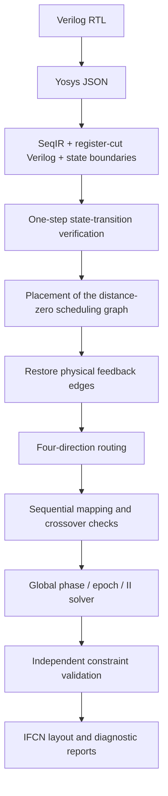

# 时序电路设计 / Sequential circuit design

[简体中文 README](../README.md) · [English README](../README.en.md)

## 范围 / Scope

iFCN 的时序流程是 sampled-state 门级布局布线研究实现，保留真实反馈线路，
并在布线后验证全局时钟相位、绝对 epoch 和启动间隔（II）。状态器件尚未完成
物理表征与多周期功能签核。结构和时钟约束通过，不等于完整的 DFF/latch
器件行为已经验证。

The sequential flow implements sampled-state placement and routing with physical
feedback and post-route clock closure. State devices still require physical
characterization and multi-cycle functional validation. Structural and clock
checks do not establish complete device-level sequential behavior.

## 数据流 / Data flow

## 算法约束 / Algorithm contracts

| 约束 / Contract | 含义 / Meaning |
|---|---|
| Physical graph | 保留普通网与反馈网；feedback edges remain physically routed. |
| Schedule graph | 仅使用 iteration distance 为零的边；positive-distance edges cross a state boundary. |
| Combinational cycles | 删除正距离边后仍有环时拒绝输入；cycles in the distance-zero graph are rejected. |
| Clock occurrence | 相位以 5×5 coarse clock tile 为单位；all cells and layers within a tile share its phase. |
| Cell trace | 有序、分层的元胞轨迹记录连通性；a cell/layer does not create an extra clock occurrence. |
| Phase witness | 导出的 tile phase map 为权威相位记录；the solver witness is independently checked. |
| State semantics | 正距离边解除当前拍调度依赖，不删除物理线路；scheduling cuts preserve physical feedback. |

旧的 `qca_cell/layer_aware_xyz` 时钟 occurrence 格式无效，不能与 tile 相位语义混用。
The obsolete `qca_cell/layer_aware_xyz` occurrence format is invalid for this model.

## 实现入口 / Implementation entry points

| 入口 / Entry point | 职责 / Responsibility |
|---|---|
| `scripts/yosys_json_to_seqir.py` | Yosys JSON 转换、状态边界与 register-cut 网表 / frontend conversion and state boundaries |
| `include/autopr/sequential/sequentialIr.*` | Physical/schedule 双图与验证 / dual-graph model and validation |
| `ifcn_sequential_pnr` | Register-cut 抽象基线 / abstract baseline; does not restore full physical feedback |
| `ifcn_paper_cyclic_pnr` | 反馈恢复、布局、布线与时钟闭合 / feedback-aware physical routing and clock closure |
| `scripts/solve_global_clock_z3.py` | 外部 Z3 求解器 / external constraint solver |
| `ifcn_physical_state_layout` | 物理状态宏布局原型 / prototype state-macro layouts |
| `scripts/run_sequential_rtl_experiments.py` | 可复现的 RTL 批量执行 / reproducible RTL experiment runner |

当前 C++ P&R 通过生成的 cut Verilog 接入 `Parse/CircuitGraph`，尚未直接消费
`SequentialIR`。组合电路布局与默认组合映射仍独立可用。

C++ P&R currently consumes the generated cut Verilog through `Parse/CircuitGraph`,
rather than consuming `SequentialIR` directly. Combinational algorithms remain
available independently.

## 验证 / Validation

构建与具体运行命令见 README。CTest 覆盖 SeqIR、全局相位约束、反馈布线、
映射元数据、状态宏以及生成波形检查。安装 `z3-solver` 并选择对应 Python
解释器后，可启用 Z3 集成测试。所有临时 QCA、向量和报告写入构建目录。

See the README for build and run commands. CTest covers SeqIR, phase constraints,
feedback routing, mapping metadata, state macros and generated-waveform checks.
Select a Python interpreter with `z3-solver` installed to enable Z3 integration
tests. Temporary QCA designs, vectors and reports are generated in the build tree.
