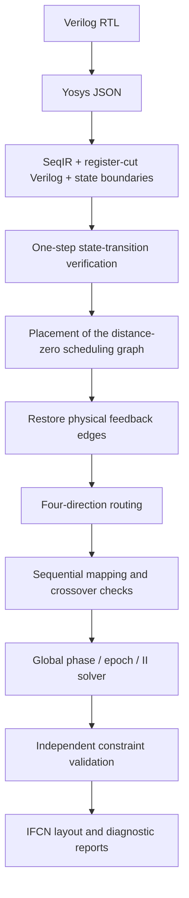

# 时序电路设计 / Sequential circuit design

[简体中文 README](../README.md) · [English README](../README.en.md)

## 范围 / Scope

iFCN 的时序流程是 sampled-state 门级布局布线研究实现，保留真实反馈线路，
并在布线后验证全局时钟相位、绝对 epoch 和启动间隔（II）。状态器件尚未完成
物理表征与多周期功能签核。结构和时钟约束通过，不等于完整的 DFF/latch
器件行为已经验证。

The sequential flow implements sampled-state placement and routing with physical
feedback and post-route clock closure. State devices still require physical
characterization and multi-cycle functional validation. Structural and clock
checks do not establish complete device-level sequential behavior.

## 与组合映射的区别 / Difference from combinational mapping

| 项目 / Item | 组合 / Combinational | 时序 / Sequential |
| --- | --- | --- |
| 拓扑 / Topology | 无环逻辑图 / Acyclic logic graph | 保留物理反馈，以 iteration distance 区分状态边界 / Physical feedback with state-boundary distances |
| 输出边界 / Output boundary | 可将输出 NOT 与输出节点融合 / An output NOT may also be the observed output node | 显式 `PreserveSequential`，保留 NOT 后独立的 D 事件 / Explicit `PreserveSequential` retains a separate D event after the NOT |
| 细胞路径 / Cell path | 允许在时钟块内部选择等价偏移路径 / Equivalent intra-tile offsets allowed | 保留有序时钟块边界与绕行 / Ordered tile traversal and detours preserved |
| 时钟 / Clocks | 同步汇合 epoch、隔离门前后相位 / Synchronized fanins and isolated gate clock boundaries | 联合求解 phase、epoch、II 与跨周期距离 / Joint phase, epoch, II and iteration-distance constraints |
| 验证 / Validation | 源真值与稳定输出比较 / Source truth versus settled outputs | 还需验证状态转移、复位与保持 / Also requires state transitions, reset and retention |

两者共享基本门库和实际元胞导出，但 `node_mapping` 与 `mapping_line` 显式传递
各自的 `MappingMode`；新增的组合时钟约束不套用于反馈图。器件层的交叉
连通性不等于增加一个时钟周期。

Both modes share primitive templates and physical-site export. Their mapping mode
is passed explicitly; combinational clock constraints are not applied to feedback
graphs. A layer transition does not create an additional clock cycle.

两个时序 CLI 在解析 cut Verilog 时显式保留输出边界。例如 `assign d=~q` 在组合模式中
可以只有 `q → d(NOT)`；时序模式保留 `q → ~q(NOT) → d(output)`，恢复反馈时得到
`d → ~q → d`。这避免将 D 与反相器融合后生成不可布线的 `d → d` 自环，同时保留
D/Q 身份与原有的跨周期约束；多个观察输出也不会被合并。该选择只控制解析边界，
不会把组合 epoch 求解器替换到时序流程中。

Both sequential CLIs preserve output boundaries when parsing cut Verilog. For
`assign d=~q`, combinational parsing can emit `q → d(NOT)`, while sequential parsing
retains `q → ~q(NOT) → d(output)`. Restoring feedback then yields `d → ~q → d`,
avoiding an unroutable `d → d` self-loop. D/Q identities, separate observed outputs
and existing iteration-distance constraints remain intact. This parsing choice does
not substitute combinational epoch solving into the sequential flow.

## 数据流 / Data flow

## 算法约束 / Algorithm contracts

| 约束 / Contract | 含义 / Meaning |
|---|---|
| Physical graph | 保留普通网与反馈网；feedback edges remain physically routed. |
| Schedule graph | 仅使用 iteration distance 为零的边；positive-distance edges cross a state boundary. |
| Combinational cycles | 删除正距离边后仍有环时拒绝输入；cycles in the distance-zero graph are rejected. |
| Clock occurrence | 相位以 5×5 coarse clock tile 为单位；all cells and layers within a tile share its phase. |
| Cell trace | 有序、分层的元胞轨迹记录连通性；a cell/layer does not create an extra clock occurrence. |
| Phase witness | 导出的 tile phase map 为权威相位记录；the solver witness is independently checked. |
| State semantics | 正距离边解除当前拍调度依赖，不删除物理线路；scheduling cuts preserve physical feedback. |

旧的 `qca_cell/layer_aware_xyz` 时钟 occurrence 格式无效，不能与 tile 相位语义混用。
The obsolete `qca_cell/layer_aware_xyz` occurrence format is invalid for this model.

## 实现入口 / Implementation entry points

| 入口 / Entry point | 职责 / Responsibility |
|---|---|
| `src/python/ifcn/sequential/yosys_json_to_seqir.py` | Yosys JSON 转换、状态边界与 register-cut 网表 / frontend conversion and state boundaries |
| `include/autopr/sequential/sequentialIr.*` | Physical/schedule 双图与验证 / dual-graph model and validation |
| `ifcn_sequential_pnr` | Register-cut 抽象基线 / abstract baseline; does not restore full physical feedback |
| `ifcn_paper_cyclic_pnr` | 反馈恢复、布局、布线与时钟闭合 / feedback-aware physical routing and clock closure |
| `src/python/ifcn/sequential/solve_global_clock_z3.py` | 外部 Z3 求解器 / external constraint solver |
| `ifcn_physical_state_layout` | 物理状态宏布局原型 / prototype state-macro layouts |
| `tests/benchmarks/run_sequential_rtl_experiments.py` | 可复现的 RTL 批量执行 / reproducible RTL experiment runner |

当前 C++ P&R 通过生成的 cut Verilog 接入 `Parse/CircuitGraph`，尚未直接消费
`SequentialIR`。组合电路布局与默认组合映射仍独立可用。

C++ P&R currently consumes the generated cut Verilog through `Parse/CircuitGraph`,
rather than consuming `SequentialIR` directly. Combinational algorithms remain
available independently.

## 验证 / Validation

构建见 README，运行示例见[算法记录](algorithm-availability.md)。CTest 覆盖 SeqIR、全局相位约束、反馈布线、
映射元数据、状态宏以及生成波形检查。安装 `z3-solver` 并选择对应 Python
解释器后，可启用 Z3 集成测试。所有临时 QCA、向量和报告写入构建目录。

See the README for building and the [algorithm record](algorithm-availability.md)
for commands. CTest covers SeqIR, phase constraints,
feedback routing, mapping metadata, state macros and generated-waveform checks.
Select a Python interpreter with `z3-solver` installed to enable Z3 integration
tests. Temporary QCA designs, vectors and reports are generated in the build tree.

`verilog_expression_semantics_regression` 检查组合输出融合与时序边界保留的区别；
`sequential_pnr_toggle_regression` 和 `sequential_cyclic_feedback_regression` 分别覆盖
cut 与反馈入口。孤立组合门的方向真值通过，不代表含反馈器件的状态行为已经验证。

`verilog_expression_semantics_regression` distinguishes combinational output fusion
from sequential boundary preservation. `sequential_pnr_toggle_regression` and
`sequential_cyclic_feedback_regression` exercise the cut and feedback entries.
Passing isolated combinational gate orientations does not validate stateful feedback behavior.
